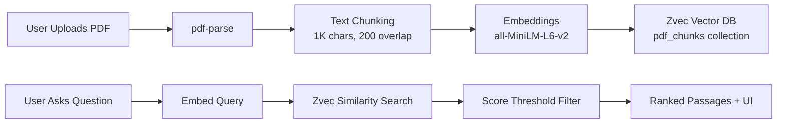

<div align="center">

# 🤖 AIrah — RAG Interactive PDF Assistant

### *Retrieval-Augmented Generation pipeline for intelligent PDF document analysis*

Upload, index, and semantically search PDF documents using local vector embeddings with **AIrah** — your intelligent document companion.

<br />

[](https://nodejs.org)
[](https://expressjs.com)
[](https://react.dev)
[](https://vite.dev)
[](https://tailwindcss.com)
[](https://github.com/alibaba/zvec)
[](https://github.com/xenova/transformers.js)
[](https://swagger.io)
[](LICENSE)

### 🧠 Tech Stack

| Runtime | Backend | Vector DB | Embeddings | Frontend | Bundler | Styling |
|:---:|:---:|:---:|:---:|:---:|:---:|:---:|
| **Node.js 18+** | **Express 5.2** | **@zvec/zvec** | **all-MiniLM-L6-v2** | **React 18** | **Vite 5.4** | **Tailwind 3.4** |

</div>

---

## 📸 Screenshots

<div align="center">
  <table>
    <tr>
      <td align="center" width="50%">
        <strong>☀️ Light Theme</strong><br /><br />
        <a href="https://github.com/sandy13869/demoRoomApp/blob/main/.github/rag-pdf-lite.png">
          
        </a>
      </td>
      <td align="center" width="50%">
        <strong>🌙 Dark Theme</strong><br /><br />
        <a href="https://github.com/sandy13869/demoRoomApp/blob/main/.github/rag-pdf-dark.png">
          
        </a>
      </td>
    </tr>
    <tr>
      <td align="center" colspan="2">
        <strong>🎯 Demo — Ask AIrah Anything</strong><br /><br />
        <a href="https://github.com/sandy13869/demoRoomApp/blob/main/.github/rag-pdf-dark2.png">
          
        </a>
      </td>
    </tr>
  </table>
</div>

---

## 📋 Table of Contents

- [Overview](#-overview)
- [Features](#-features)
- [Architecture](#-architecture)
- [Quick Start](#-quick-start)
- [Development](#-development)
- [Configuration](#-configuration)
- [Application Workflow](#-application-workflow)
- [API Reference](#-api-reference)
- [Available Scripts](#-available-scripts)
- [Project Structure](#-project-structure)
- [License](#-license)

---

## 🔭 Overview

**AIrah** is a full-stack, production-grade application that enables semantic search over PDF content using Retrieval-Augmented Generation (RAG) principles. It extracts text from uploaded PDFs, generates vector embeddings locally via transformer models, and stores them in Alibaba's **Zvec** — a lightning-fast, in-process vector database.

Users can upload PDFs, ask natural-language questions, and retrieve the most semantically relevant passages with similarity scores — all without sending data to external APIs or relying on cloud infrastructure.

> ⚠️ **Note:** The question-answering endpoint performs **extractive retrieval** — answers are composed of the most relevant source passages. It does **not** call a generative LLM.

---

## 🚀 Features

- **🤖 AIrah — Your Intelligent Assistant** — Named interactive agent with personalized responses, sound effects, and contextual guidance
- **📄 PDF Upload & Ingestion** — 50 MB limit with PDF signature validation, page-aware text extraction, and 10-file maximum
- **🔍 Semantic Search** — Ask questions and retrieve the most relevant passages with configurable scoring thresholds
- **🧠 Local Embeddings** — 384-dimensional vectors via `Xenova/all-MiniLM-L6-v2`, no external API calls, batched inference for speed
- **⚡ In-Process Vector DB** — Zvec runs inside your application process with zero infrastructure overhead
- **📂 Scoped or Cross-Document Retrieval** — Search across all PDFs or narrow to a single document
- **🔎 Multi-Query Retrieval** — Automatically reformulates your question into 3–6 search variants for higher recall
- **✏️ Smart Query Preprocessor** — Fixes spelling mistakes, expands contractions/abbreviations, and enriches queries with synonyms for better matching
- **💡 Intelligent "No Match" Suggestions** — When no relevant content is found, AIrah suggests clickable questions tailored to your uploaded PDFs
- **🎨 Stunning UI** — Dark/light theme with smooth animations, react-markdown rendering, and syntax-highlighted code blocks
- **🔊 Interactive Sound Effects** — Web Audio API synthesizer provides click, send, response, error, and success sounds
- **📊 Swagger API Explorer** — Interactive API documentation at `/api-docs`
- **🔒 Enterprise-Grade Security** — Helmet headers, configurable CORS, request logging, and structured JSON error responses
- **🧪 Deterministic Testing** — Comprehensive test suite using Node's built-in test runner

---

## 🏗 Architecture



---

## 🏁 Quick Start

### Prerequisites

- [Node.js](https://nodejs.org) 18 or later
- npm (ships with Node.js)
- A supported Zvec platform: **Windows x64**, **Linux x64/ARM64**, or **macOS ARM64**

### Installation

```bash
# Clone the repository
git clone https://github.com/sandy13869/vector-db.git
cd vector-db

# Install dependencies
npm install

# Configure environment
cp .env.example .env

# Build the client and start the server
npm run build
npm start
```

> **Windows PowerShell users:** Use `Copy-Item .env.example .env` if `cp` is unavailable.

### Access the Application

| Resource | URL |
|---|---|
| Application UI | [http://localhost:3000](http://localhost:3000) |
| Swagger API Explorer | [http://localhost:3000/api-docs](http://localhost:3000/api-docs) |
| Health Check | [http://localhost:3000/api/health](http://localhost:3000/api/health) |

> The embedding model (~90 MB) is downloaded and cached on first use. An internet connection is required for the initial download.

---

## 💻 Development

Run the server and Vite client in separate terminals for hot-reload development:

```bash
# Terminal 1 — Express API (port 3000)
npm run dev

# Terminal 2 — Vite dev server (port 5173)
npm run dev:client
```

Vite proxies `/api` requests to the Express server. In production, `npm run build` creates the optimized client bundle in `client/dist`, which Express serves from `/`.

---

## ⚙️ Configuration

Create a `.env` file from the template:

```env
PORT=3000
NODE_ENV=development
RAG_SCORE_THRESHOLD=0.15
ZVEC_DATA_PATH=./zvec_data
# CORS_ORIGIN=http://localhost:5173
```

### Environment Variables

| Variable | Default | Description |
|---|---|---|
| `PORT` | `3000` | HTTP server port |
| `NODE_ENV` | unset | Set to `development` for stack traces in API errors |
| `RAG_SCORE_THRESHOLD` | `0.15` | Minimum cosine-similarity score for a passage to be returned |
| `ZVEC_DATA_PATH` | `./zvec_data` | Persistent Zvec collections and PDF registry location |
| `CORS_ORIGIN` | all origins | Restrict browser origin when explicitly configured |

> PDF embeddings are L2-normalized, so inner-product scores are equivalent to **cosine similarity**. Higher scores indicate greater relevance.

---

## 🔄 Application Workflow

1. **Upload** a text-based PDF via the UI or `POST /api/pdf/upload`
2. **Extract** text page by page using `pdf-parse`
3. **Chunk** text into segments of up to 1,000 characters with 200-character overlap
4. **Embed** each chunk into a normalized 384-dimensional vector using `all-MiniLM-L6-v2` (batched 32 at a time)
5. **Store** chunks and metadata in the `pdf_chunks` Zvec collection (batched 1024 at a time)
6. **Preprocess** — user query is cleaned: spelling corrected, contractions/abbreviations expanded, and synonyms appended
7. **Reformulate** — the cleaned query is expanded into 3–6 search variants (who/what/where/when/why/how/describe patterns)
8. **Multi-Query Embedding** — all search variants are embedded and each is searched independently against the vector DB
9. **Merge & Deduplicate** — results from all variants are merged, deduplicated by text, and the best score per chunk is kept
10. **Filter** — results below `RAG_SCORE_THRESHOLD` are omitted; if none remain, AIrah suggests contextual questions to the user
11. **Display** — ranked passages are returned to the UI with similarity scores and collapsible source citations

> **Note:** Scanned/image-only PDFs are not OCR-processed and will return HTTP 422 due to missing extractable text.

---

## 📖 API Reference

All JSON responses include a `success` boolean. Errors follow a consistent schema:

```json
{
  "success": false,
  "error": {
    "message": "Description of the problem"
  }
}
```

---

## 📦 Available Scripts

| Command | Purpose |
|---|---|
| `npm start` | Start the production Express server |
| `npm run dev` | Start the server with Nodemon for hot-reload |
| `npm run dev:client` | Start the Vite development server |
| `npm run dev:all` | Start both Express API + Vite dev server concurrently |
| `npm run build` | Build the React client for production |
| `npm test` | Run the PDF chunking test suite |
| `npm run check` | Run tests and build the client |

---

## 🗂 Project Structure

```text
.
├── client/                          # React frontend
│   ├── src/
│   │   ├── components/
│   │   │   ├── ChatPanel.jsx       # Q&A chat interface
│   │   │   ├── DocumentList.jsx    # Uploaded documents list
│   │   │   └── UploadPanel.jsx     # PDF upload component
│   │   ├── api.js                  # API client utilities
│   │   ├── utils/
│   │   │   └── sounds.js           # Web Audio API sound synthesizer
│   │   └── App.jsx                 # Main application layout
│   └── vite.config.js              # Vite config + dev proxy
├── src/                             # Express backend
│   ├── config/
│   │   ├── database.js             # Zvec collection & CRUD service
│   │   ├── custom.js               # Custom app configuration
│   │   └── swagger.js              # OpenAPI specification
│   ├── middleware/
│   │   ├── errorHandler.js         # Global error handling
│   │   ├── requestLogger.js        # Request logging
│   │   └── upload.js               # Multer upload config
│   ├── routes/
│   │   ├── documents.js            # Document CRUD routes
│   │   ├── health.js               # Health check routes
│   │   ├── index.js                # Route aggregator
│   │   └── pdf.js                  # PDF upload & Q&A routes
│   ├── services/
│   │   ├── embeddingService.js     # Embedding generation
│   │   ├── fileHandling.js         # Standalone PDF indexing
│   │   ├── pdfService.js           # PDF processing pipeline
│   │   ├── queryPreprocessor.js    # Spell correction + synonym enrichment
│   │   └── ragService.js           # RAG orchestration + multi-query retrieval
│   ├── utils/
│   │   └── demoData.js             # Sample data seeding
│   └── index.js                    # Express app entry point
├── tests/
│   └── pdfService.test.js          # PDF service tests
├── .env.example                    # Environment template
├── .gitignore
├── package.json
└── README.md
```

---

## 📄 Storage Schema

### `documents` Collection

| Field | Type | Description |
|---|---|---|
| `id` | `String` | Primary document ID |
| `title` | `String` | Document title |
| `category` | `String` | Document category |
| `year` | `Int32` | Publication year |
| `embedding` | `Float32[768]` | 768-dimensional vector |

### `pdf_chunks` Collection

| Field | Type | Description |
|---|---|---|
| `id` | `String` | Primary key (`{docId}_{chunkIndex}`) |
| `text` | `String` | Extracted text content |
| `source` | `String` | Original sanitized filename |
| `docId` | `String` | Parent document ID |
| `page` | `Int32` | Source page number |
| `chunkIndex` | `Int32` | Chunk sequence number |
| `embedding` | `Float32[384]` | 384-dimensional embedding vector |

> Uploaded-document metadata is stored atomically in `<ZVEC_DATA_PATH>/pdf_registry.json`. Zvec uses write-ahead logging (WAL) for durable collection storage.

---

## 👤 Author

**Sandy**  
[](https://github.com/sandy13869)

---

## 📄 License

This project is licensed under the **ISC License**. See the [LICENSE](LICENSE) file for details.

---

## 🛡 Security

- Helmet configures common HTTP security headers.
- CORS can be restricted with `CORS_ORIGIN`.
- JSON request bodies are limited to 10 MB.
- PDF uploads are limited to 50 MB and checked for a `%PDF-` signature.
- Filenames are sanitized before being persisted.
- API inputs, vector dimensions, numeric values, IDs, and query limits are validated.
- `.env` and `zvec_data/` are excluded from version control.
